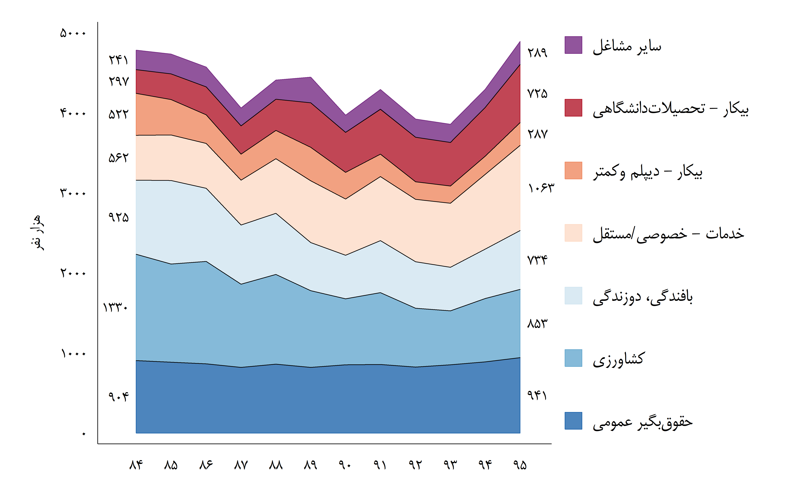

| مقالات فارسی   |
|--------------:|
|               |
| بررسی عرضه و تقاضای نیروی كار زنان در بازار كار ایران     [لینک](http://www.lssi.ir/DesktopModules/News/NewsView.aspx?TabID=1&Site=DouranPortal&ItemID=1007&mid=14472&wVersion=Staging&lang=fa-IR)|
|| 
|               |
|گزارش نظام بازتوزیع درآمد  [لینک](http://www.imps.ac.ir/uploads/barnamerizi-tozi-daramad.pdf)| 
|               |
|               |
|مهاجرت بین استانی در ایران برای بازه ۴۵ ساله منتهی به ۱۳۹۵ |
|               |
|               |
|چابکسازی در بازارکار [دنیای اقتصاد ۱۳۹۶/۱۲/۲۶](https://donya-e-eqtesad.com/%D8%A8%D8%AE%D8%B4-%D8%A8%D8%A7%D8%B4%DA%AF%D8%A7%D9%87-%D8%A7%D9%82%D8%AA%D8%B5%D8%A7%D8%AF%D8%AF%D8%A7%D9%86%D8%A7%D9%86-52/3367356-%DA%86%D8%A7%D8%A8%DA%A9-%D8%B3%D8%A7%D8%B2%DB%8C-%D8%AF%D8%B1-%D8%A8%D8%A7%D8%B2%D8%A7%D8%B1-%DA%A9%D8%A7%D8%B1)|
|               |
|               |
|بار ابرچالشها روی دوش فقرا [تجارت فردا شماره 262](http://www.tejaratefarda.com/%D8%A8%D8%AE%D8%B4-%D8%A7%DB%8C%D8%B1%D8%A7%D9%86-%D8%A7%D9%82%D8%AA%D8%B5%D8%A7%D8%AF-%D8%A7%D8%AC%D8%AA%D9%85%D8%A7%D8%B9%DB%8C-20/26283-%D8%A8%D8%A7%D8%B1-%D8%A7%D8%A8%D8%B1%DA%86%D8%A7%D9%84%D8%B4-%D9%87%D8%A7-%D8%B1%D9%88%DB%8C-%D8%AF%D9%88%D8%B4-%D9%81%D9%82%D8%B1%D8%A7) |

 

